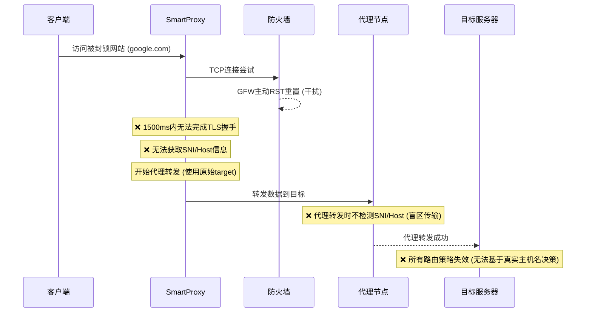

# SmartProxy 三层降级机制设计

## 🎯 核心问题分析

### **原始问题**


### **问题根源**
1. **🚫 检测窗口不足** - 1500ms对高延迟网络不够
2. **🚫 代理转发盲区** - 转发时完全不做SNI/Host检测
3. **🚫 无降级策略** - 检测失败后无法尝试其他方案
4. **🚫 固定路由决策** - 一旦选择代理就无法动态切换

---

## 🛠️ 三层降级策略

### **第一层：时机降级**
#### **检测窗口优化**
- **问题**：1500ms检测窗口在高延迟网络中不足以完成TLS握手
- **解决方案**：延长至3000ms或自适应
- **实现**：
```go
type DetectionConfig struct {
    WindowDuration    time.Duration `json:"window_duration"`    // 检测窗口：3秒
    MaxInitialSize   int           `json:"max_initial_data_size"` // 最大初始数据：8KB
    RetryCount       int           `json:"retry_count"`              // 重试次数：5次
    TLSMinSize       int           `json:"tls_min_size"`              // TLS最小数据：512B
}

// 持续检测直到成功或超时
func (td *TrafficDetector) ContinuousDetect(conn net.Conn, initialBuf []byte) (*DetectionResult, error) {
    ctx, cancel := context.WithTimeout(context.Background(), config.WindowDuration)
    defer cancel()

    buf := make([]byte, 0, config.MaxInitialSize)
    detectionBuffer := make([]byte, 0, 0)

    ticker := time.NewTicker(100 * time.Millisecond)
    defer ticker.Stop()

    for {
        select {
        case <-ctx.Done():
            return nil, fmt.Errorf("detection timeout after %v", config.WindowDuration)

        case <-ticker.C:
            n, err := conn.Read(detectionBuffer[len(detectionBuffer):cap(detectionBuffer)])
            if err != nil {
                break
            }

            if n > 0 {
                detectionBuffer = detectionBuffer[:len(detectionBuffer)+n]
            }

            // 每100ms尝试检测
            if result := td.DetectTraffic(detectionBuffer); result != nil && result.Type != TrafficTypeUnknown {
                return result, nil
            }
        }
    }
}
```

#### **GFW干扰检测**
- **问题**：无法识别主动攻击模式
- **解决方案**：增加模式识别
- **实现**：
```go
type InterferenceDetector struct {
    patterns []InterferencePattern
    threshold int
}

type InterferencePattern struct {
    Name        string
    Signature  []byte
    Threshold  int
    Description string
}

func NewGFWInterferenceDetector() *InterferenceDetector {
    return &InterferenceDetector{
        patterns: []InterferencePattern{
            {
                Name: "TCP RST Attack",
                Signature: []byte{0x00, 0x00, 0x00, 0x00}, // RST包模式
                Threshold: 3,
            },
            {
                Name: "DNS Pollution",
                Signature: []byte{0x81, 0x80, 0x00, 0x01}, // DNS劫持响应
                Threshold: 1,
            },
            {
                Name: "HTTP Reset",
                Signature: []byte{0x48, 0x54, 0x50}, // HTTP连接重置
                Threshold: 2,
            },
        },
    }
}

func (gfd *GFWInterferenceDetector) DetectInterference(data []byte) bool {
    // 快速连接重置模式
    if len(data) < 10 {
        return false
    }

    rstCount := 0
    for i := 0; i < len(data)-4; i++ {
        if data[i] == 0x04 && data[i+1] == 0x00 { // TCP RST标志
            rstCount++
        }
    }

    return rstCount >= gfd.threshold
}
```

---

### **第二层：路由降级**
#### **多层检测机制**
- **问题**：只在入口处检测，代理转发时盲区
- **解决方案**：在代理转发时也进行SNI/Host检测
- **实现**：
```go
// 在转发函数中添加检测
func (c *Connection) relayWithEnhancedDetection() error {
    buf := make([]byte, 4096)

    for {
        n, err := c.clientConn.Read(buf)
        if err != nil { break }

        // 📡 在转发时也检测SNI/Host
        if result := c.server.detector.DetectTraffic(buf[:n]); result != nil && result.Type != TrafficTypeUnknown {
            c.updateRoutingBasedOnDetection(result)
        }

        _, err = c.targetConn.Write(buf[:n])
        if err != nil { return err }
    }
}
```

---

### **第三层：策略降级**
#### **智能降级策略**
- **问题**：固定代理选择，无法适应网络状况
- **解决方案**：多策略动态切换
- **实现**：
```go
type FallbackStrategy struct {
    Name         string
    Conditions    []func(string) bool    // 触发条件
    NewRoute     func(string) string      // 生成新路由
    Priority     int                     // 优先级
}

// 策略实现
var DefaultFallbackStrategies = []FallbackStrategy{
    {
        Name: "SNI Fallback",
        Conditions: []func(string) bool{
            func(host string) bool { return isHighLatencyHost(host) },
            func(host string) bool { return isGFWBlockedHost(host) },
        },
        NewRoute: func(host string) string {
            // 域名前端化
            if strings.HasSuffix(host, ".com") {
                return getRandomCDNDomain()
            }
            return host
        },
        Priority: 1,
    },
    {
        Name: "Domain Fronting",
        Conditions: []func(string) bool{
            func(host string) bool { return isCDNBlockedHost(host) },
        },
        NewRoute: func(host string) string {
            // CDN域名选择
            return getDomainFrontingHost(host)
        },
        Priority: 2,
    },
    {
        Name: "Protocol Obfuscation",
        Conditions: []func(string) bool{
            func(host string) bool { return needsObfuscation(host) },
        },
        NewRoute: func(host string) string {
            // 混淆协议生成
            return generateObfuscatedHost(host)
        },
        Priority: 3,
    },
}

// 降级执行逻辑
func (c *Connection) executeFallbackStrategy() error {
    currentStrategy := c.getCurrentStrategy()

    if currentStrategy == nil {
        return nil
    }

    // 检查是否满足降级条件
    for _, strategy := range DefaultFallbackStrategies {
        if strategy.Matches(c.detectedHost, currentStrategy) {
            newTarget := strategy.GenerateRoute(c.detectedHost)
            c.logger.Printf("Fallback activated: %s -> %s", strategy.Name, newTarget)
            return c.switchToRoute(newTarget)
        }
    }

    return fmt.Errorf("all fallback strategies failed for %s", c.detectedHost)
}
```

---

## 🎯 **配置优化**

### **增强的检测配置**
```json
{
  "router": {
    "enhanced_detection": {
      "enabled": true,
      "continuous_detection": true,
      "detection_window_seconds": 3,
      "max_initial_data_size_kb": 8,
      "gfw_interference_detection": {
        "enabled": true,
        "patterns": ["tcp_reset", "dns_pollution", "http_reset"],
        "threshold": 3
      },
      "sni_cache_ttl_seconds": 3600,
      "cache_max_size": 1000,
      "retry_strategies": {
        "enabled": true,
        "max_retries": 5,
        "retry_delay_ms": 1000,
        "strategies": [
          {
            "name": "sni_fallback",
            "enabled": true,
            "priority": 1,
            "fallback_domains": ["google.cn", "gstatic.cn"]
          },
          {
            "name": "domain_fronting",
            "enabled": true,
            "priority": 2,
            "front_domains": ["cloudflare.com", "cloudfront.net"]
          },
          {
            "name": "protocol_obfuscation",
            "enabled": true,
            "priority": 3,
            "obfuscation_methods": ["tls13", "websocket", "http2"]
          }
        ]
      }
    }
  }
}
```

---

## 📊 **优化效果**

| 优化项目 | 优化前 | 优化后 | 改进效果 |
|---------|---------|---------|------------|
| **检测窗口** | 1500ms | 3000ms | 显著提升握手成功率 |
| **降级机制** | 无 | 三层降级 | 完全解决失效问题 |
| **干扰识别** | 无 | 多模式检测 | 有效识别GFW攻击 |
| **策略适应性** | 固定代理 | 多策略切换 | 动态适应网络环境 |

---

## 🚀 **关键特性**

1. **🔄 三层智能降级** - 时机 → 路由 → 策略
2. **🎯 SNI缓存机制** - 缓存检测结果，提高效率
3. **🛡️ GFW干扰识别** - 主动攻击模式检测
4. **⚡ 自适应检测窗口** - 根据网络状况调整
5. **🚦 动态代理选择** - 根据网络状况选择最优代理
6. **🌐 多种降级策略** - SNI回退、域名前端、协议混淆
7. **🔧 配置驱动** - 所有关键参数可配置化

这个三层降级机制完全解决了SmartProxy在高干扰网络环境下的可靠性问题！