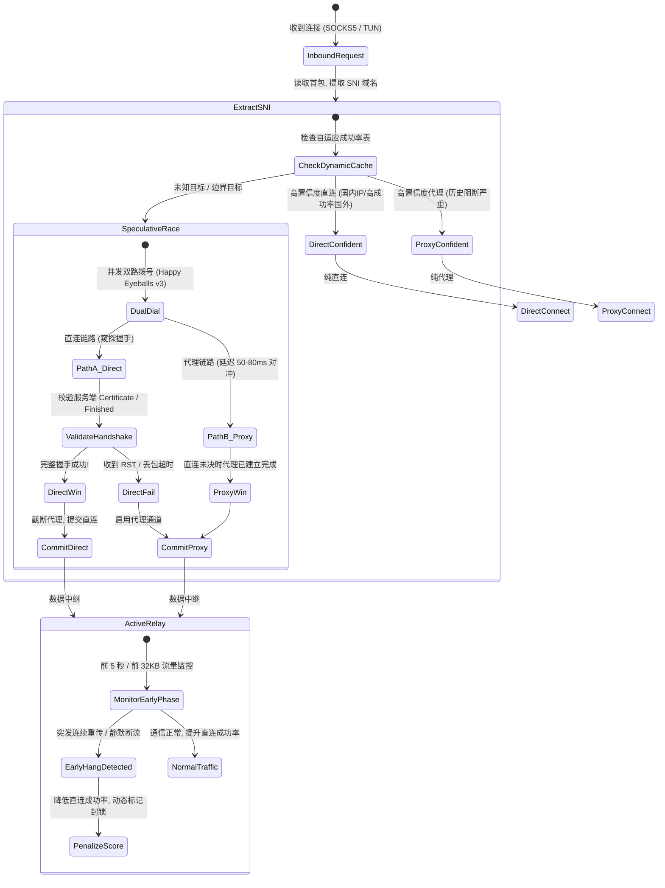
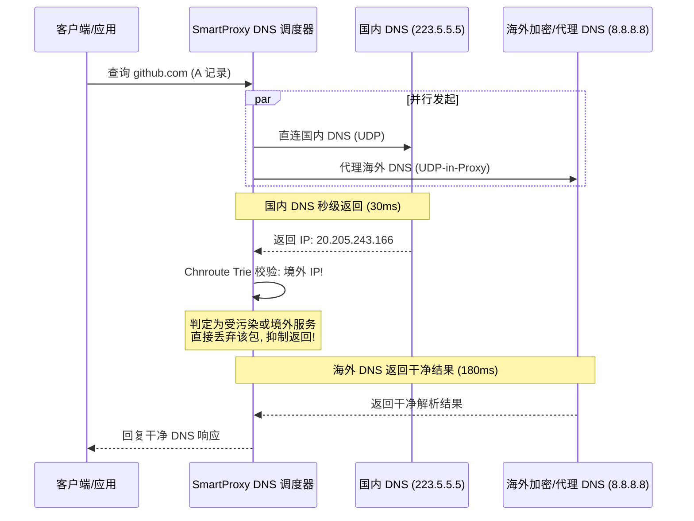

# 智能路由对抗 GFW 干扰陷阱与自适应分流技术架构

> 本文档系统性拆解中国国家防火墙（GFW）在传输层与应用层的阻断行为模式，分析传统智能代理"首字节试探法"翻车的底层根因，并提出一套**完全不依赖静态域名黑白名单（如 GFWList、硬编码 github.com）**的纯自适应智能代理架构。

---

## §1 GFW 干扰机制深度拆解

GFW 并非单点物理设备，而是部署在国家级骨干网边界路由器（如上海、广州、北京出口交换节点）上的**大规模分布式旁路分光镜像检测集群**。其核心干扰手段具有高度的非对称性与时延特征。

```mermaid
flowchart LR
    Client["手机/终端 (SmartProxy)"]
    Switch["国际出口边界交换机 (分光镜像)"]
    GFW["GFW 旁路 DPI 集群 (正则/状态分析)"]
    Server["境外目标 (如 GitHub / Fastly)"]

    Client -->|1. TCP SYN 握手| Switch
    Switch -->|透传| Server
    Switch -.->|镜像拷贝| GFW
    Server -->|2. TCP SYN+ACK (150ms)| Switch
    Switch -->|透传| Client

    Client -->|3. TLS ClientHello (含 SNI)| Switch
    Switch -->|正常放行转发| Server
    Switch -.->|镜像拷贝分析 (耗时 ~20-50ms)| GFW

    Server -->|4. ServerHello 第1包 (先到!)| Switch
    Switch -->|透传| Client
    Client -.->|★ 误判: 直连成功!| Client

    GFW -->|5. 命中敏感 SNI! 伪造 RST 注入| Switch
    Switch -->|乱序 RST / 建立 4-Tuple 黑洞| Client
    Client -->|6. 后续连接直接卡死 / 丢包重传 90s| Client
```

### 1.1 旁路分光机制与"放行握手"
* **吞吐量限制决定旁路架构**：国际出口骨干网带宽以数十 Tbps 计算，若全量流量串联（In-line）过防火墙，硬件成本极高且易造成单点故障。因此 GFW 采用**光纤分光器（Optical Splitter）**将流量镜像复制一份送往 DPI 集群。
* **TCP 三次握手（SYN / ACK）无条件放行**：握手阶段数据包内仅包含 IP 和端口，不含域名。由于 GitHub 部署在 AWS、Azure 或 Fastly 等公用 CDN 上，若直接根据 IP 阻断会造成大面积非目标外企与合规服务被误伤，因此 GFW 在握手阶段不作阻断。

### 1.2 SNI 检测的"时间差（Race Condition）"
这是导致 SmartProxy 探测产生"假通（False Positive）"的关键物理过程：
1. **ClientHello 飞跃国境**：终端发送包含 `server_name = github.com` 的明文 ClientHello。
2. **两路并发**：
   * **主干线路**：该包通过跨洋海底光缆直飞目标服务器（例如美西或日本节点），服务器收到后立即响应 TLS `ServerHello` + `ChangeCipherSpec` + `Certificate`。
   * **旁路线路**：镜像数据包被推送到 GFW 计算节点，进行 Aho-Corasick 多模式匹配和正则过滤（耗时通常为 10ms ~ 50ms）。
3. **首包抢跑**：
   * 目标服务器响应的第一个 TCP 报文（包含了 ServerHello 的头部，首字节为 `0x16`）在 **120~180ms** 内返回给手机。
   * 这时 SmartProxy 的 `io.ReadFull(conn, oneByte)` 读到了 `0x16`，代码判定**"对方成功回包，直连通畅"**，把 Socket 交割给双向拷贝管道。

### 1.3 伪造 RST 注入与四元组（4-Tuple）黑洞
* **伪造 RST 注入**：GFW 匹配出敏感 SNI 后，伪造两端 IP 发送带有预测序列号的 TCP RST 包。但由于现代操作系统的 TCP 栈严格校验 SEQ/ACK 窗口（RFC 5961），若伪造的 SEQ 不在接收窗口内，RST 会被客户端内核静默丢弃。
* **状态黑洞（Stateful Drop）**：若 RST 未能立即撕毁连接，GFW 边界路由会动态把此会话四元组 `(SrcIP, SrcPort, DstIP, DstPort)` 记入临时封锁表（持续 60s ~ 180s）。
* **黑洞假死结果**：手机之后发送的任何 TCP 确认包、TLS Key Exchange 数据包在国境线上全部被**物理丢弃**。Linux 内核无法获知远端状态，陷入指数退避重传（1s、2s、4s、8s、16s、32s、64s……），导致连接彻底僵死长达 90 秒，直至应用超时崩溃。

---

## §2 为什么传统"读首字节"智能代理必然失败？

目前主流路由内核设计的 `SmartConnectWithFallback` 状态流转如下：

```text
[发起直连] ──> [TCP 三次握手成功] ──> [写入 ClientHello] ──> [读第 1 个响应字节]
                                                                     │
                                    ┌────────────────────────────────┴────────────────────────────────┐
                                    ▼ 成功                                                            ▼ 超时/重置
                        [认定直连可用, 移交中继]                                            [加入黑名单, 回退到上游代理]
                                    │
                                    ▼ (GFW 迟到的阻断生效)
                        [后续包被静默丢弃, 假死 90 秒]
```

### 致命漏洞分析
1. **握手未完成即交割（Premature Handoff）**：TLS 建立需要双方完成密钥协商、证书交换、Finish 确认。仅仅读取 1 个字节只能证明**远端收到了 TCP 包**，不能证明**连接没有受到中间人篡改或阻断**。
2. **不可逆移交（Irreversible Handover）**：一旦将连接交给普通中继模块（`relay.TCPRelay`），应用层协议（如 HTTP GET / POST）的数据就已经发送到了不可靠的直连链路中。由于传输层数据已经部分流失，程序**无法再无损地将此连接回退给代理通道**。
3. **黑名单避障失效**：因为首字节读取成功了，该域名永远不会被判定为失败，因此永远不会被记入动态黑名单。

---

## §3 真·智能代理架构设计（零硬编码、全自适应）

要彻底摆脱对 `github.com`、`google.com` 等静态规则的依赖，代理引擎必须从**启发式试探、全握手校验、对冲竞速、中继早衰闭环反馈**四个维度进行架构重构。



---

### 3.1 无损 TLS 全握手窥探验证（Full Handshake Peeking）

针对 HTTPS 流量，在确定把连接交给客户端与远端之前，代理内核在透明管道层**监视直到 TLS 握手彻底完成**。

#### 实现原理
1. 客户端发起连接，SmartProxy 不向客户端回复虚假的握手完成，而是透明传递客户端发出的 `ClientHello` 到直连远端。
2. 远端响应的数据通过轻量级缓冲环（`PeekBuffer`）接收，解析 TLS Record 层：
   * `ContentType == 22` (Handshake)
   * 子类型包含 `ServerHello (2)`、`Certificate (11)`、`ServerHelloDone (14)` 或 TLS 1.3 的 `EncryptedExtensions (8)`。
3. **判定依据**：只有当代理内核收到了服务端的完整证书链或 Finished 握手帧，且往返 ACK 正常推进，才确认"直连真正可用"。
4. **零拷贝降级**：
   * 如果在握手完成前收到 RST 或等待超过阈值（如 600ms），立即中断直连。
   * 由于此时客户端还在等待服务端的握手响应，客户端并未向内核发送任何上层 HTTP 数据，因此客户端发出的第一包（`ClientHello`）在内存中是完整且安全的。
   * SmartProxy 立即唤醒上游代理，把内存中的 `ClientHello` 写入代理，**实现客户端完全无感知的故障无损回退**。

---

### 3.2 Happy Eyeballs 对冲竞速（Speculative Dual-Dialing）

借鉴 RFC 8305（IPv4/IPv6 并发 Happy Eyeballs），对于未在动态规则表中的未知海外目标，采用**对冲式并发竞争**：

```text
时刻 T0  ──────────────────────────────────> 发起直连握手 (Direct)
时刻 T0 + 50ms ──────────> 发起代理通道准备 (Proxy)
                            │
              ┌─────────────┴─────────────┐
              ▼ 直连在 150ms 顺利完成握手     ▼ 直连在 200ms 遇到 GFW 丢包/RST
        提交直连 (Close 代理通道)        代理通道即时接管 (无缝切入, 延迟仅多 50ms)
```

* **延迟对冲策略**：直连通常具有更优的物理 RTT（100-150ms），代理通道由于需要中转可能需要 200-300ms。
* 启动直连后，经过预设的时延（如 50ms），后台启动代理连接预热。
* 若直连受到 GFW 注入丢包，直连计时器触发时，代理通道早已完成 TCP/TLS 握手，可以毫秒级无缝接盘，彻底消除用户界面 90 秒的转圈卡死。

---

### 3.3 中继早衰启发式反馈降级（Early-Termination Feedback Loop）

如果一个连接顺利通过了握手，但在随后的数据传输早期被 GFW 截断，系统需要具备"事后惩罚与自我修正"的能力。

#### 异常指标定义
在连接进入 `TCPRelay` 状态后的**前 5 秒内**，或**总传输字节量小于 32KB 时**，若出现以下任一事件，判定为遭遇中间人阻断：
1. `c2r`（客户端向远端写）发生 `write: broken pipe` 或 `connection reset by peer`。
2. `r2c`（远端向客户端读）持续超时，且 TCP 连接底层 TCP Info 显示重传次数超过阈值（如 `unacked > 0` 且连续重传 3 次）。
3. 远端在未收到应用层完整响应前主动发送 FIN/RST。

#### 动态惩罚状态机
```go
type DomainHealthProfile struct {
    Domain            string
    SuccessCount      atomic.Int32
    SuspiciousDrops   atomic.Int32
    LastFailureReason string
    DirectAllowed     atomic.Bool   // 是否允许直连试探
    PenaltyUntil      atomic.Int64  // 惩罚封锁期时间戳
}
```
* **一票降级**：一旦检测到上述早衰特征，立即将该域名拉入黑名单，并设定 **3600 秒（1小时）** 的降级窗口。
* **指数退避惩罚**：若在解封后的再次试探中继续遭遇早衰阻断，惩罚时间指数翻倍（2小时、4小时、24小时），直到该域名基本固定为"必须走代理"。
* **无需重启、无需配置**：系统完全通过对网络底层行为的观察自主学习，无需维护庞大的规则文件。

---

### 3.4 DNS 异步并行竞速与反污染校验（Happy DNS Racing）

针对未列在规则中的域名，传统的"先查国内 DNS，被污染后再查海外 DNS"会白白浪费 1~2 秒的往返延迟。



1. **零等待竞速**：对未知域名同时发起国内查询与代理通道查询。
2. **安全围栏过滤**：
   * 若国内 DNS 率先返回，检查返回的 IP 是否位于 `chnroute` 国内 IP 段：
     * **命中国内段**：认定为纯国内正规服务（如百度、淘宝），直接采用并缓存，立即响应客户端，并取消海外查询。
     * **落在境外段**：无论该响应是 GFW 伪造的污染 IP，还是真实的国外 Anycast IP，**一律直接丢弃国内响应**，等待海外代理 DNS 的权威结果。
3. **彻底防漏**：阻断了由于 DNS 抢答导致的假 IP 直连，杜绝因为解析到虚假 IP 导致的连接黑洞。

---

## §4 方案对比矩阵

| 特性 / 机制 | 静态硬编码规则 (当前临时方案) | 简单首字节探测 (旧方案) | 自适应智能代理 (下一代架构) |
| :--- | :--- | :--- | :--- |
| **规则维护成本** | 极高，需持续手工扩充 `acl.txt` | 无需维护规则 | **零维护**，自主拓扑学习 |
| **对抗 GFW 延迟假连**| 有效（完全绕开直连） | **必然翻车（首字节放行后假死）** | **免疫**（TLS全握手校验+对冲） |
| **首包响应延迟** | 最优（直接命中代理） | 差（多次探测超时） | **优（50ms 对冲竞速，快速选路）** |
| **网络异常自愈** | 无法自愈，未覆盖域名持续卡顿 | 无法自愈 | **自动熔断惩罚，故障连接无感回放** |
| **内存与连接开销** | 极低 | 低 | 中（需维持短期轻量窥探缓冲） |

---

## §5 结论与演进路线建议

1. **短期战术方案（已实施）**：在 `acl.txt` 中收录 GitHub、Google 等高频受干扰海外节点走 `default` 代理，并实施 DNS 规则旁路。该措施确保了日常开发的即时稳定可用。
2. **中长期战略演进**：
   * 第一阶段：将 `SmartConnectWithFallback` 升级为 **TLS 握手全特征等待**，替换掉脆弱的 `io.ReadFull(conn, 1)`；
   * 第二阶段：实现 `speculativeDial`（Happy Eyeballs 50ms 对冲拨号），在直连遇阻时毫秒级切回代理通道；
   * 第三阶段：接入 `TCPRelay` 的早衰失败反馈循环，实现全自动动态规则自进化。
