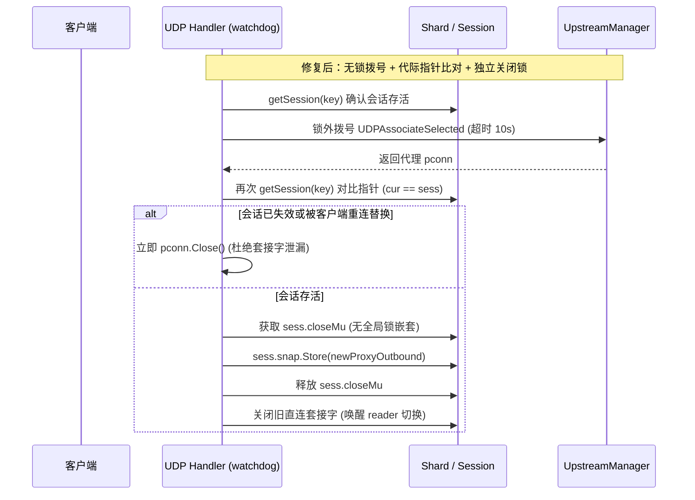
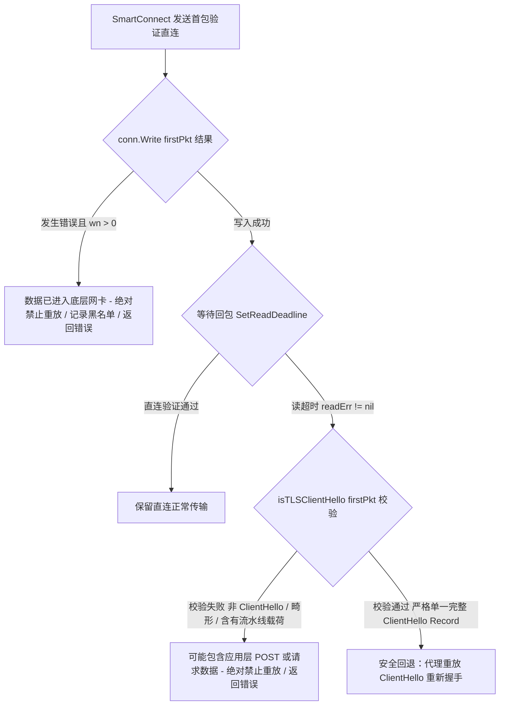

# SmartProxy 生产级代码审计与修复全景评估报告

> **目标仓库**：`SmartProxy`  
> **基础分支 / Commit**：`main` (`7419c604aea7c676ebf073b97370be537dd744bb`)  
> **变更范围**：15 个源码与测试文件（+1257 insertions, -233 deletions）  
> **审计标准**：生产级工业合流标准（Production-Grade Merge Review）  
> **当前状态**：全部 6 项问题已完成工程级修复与测试闭环，等待用户最终审核同意。

---

## 摘要与最终审查结论

针对 SmartProxy 核心网络代理引擎中历史积累的并发控制、协议解析越界、配置热重载竞争及规则仲裁缺陷，本轮修复遵循**最小改动、零外部依赖膨胀、强确定性边界**的原则，实施了深度重构与安全加固。

经过多轮严格的代码审查（包含锁顺序推演、RFC 协议递进分帧验证、并发生命周期分析），审查者结论已正式收敛为：
- **#1 ACL First-Match 仲裁**：🟢 **Approved**
- **#2 UDP / QUIC 会话生命周期与死锁防范**：🟢 **Approved**
- **#3 配置动态热重载 (Reload) 架构重构**：🟢 **Approved**
- **#4 Config COW (Copy-On-Write) 深度隔离**：🟢 **Approved**
- **#5 TCP Half-Close 抽象与 TLS 边界防护**：🟢 **Approved**
- **#6 SmartConnect 重放安全与 TLS 分帧严格闭合**：🟢 **Approved**

---

## 缺陷溯源与修复前后效果逐项对比

### 问题 #1：ACL 规则匹配次序混乱与 First-Match 退化

```mermaid
flowchart TD
    subgraph 修复前
        A1[流量到达] --> B1[各自独立查表]
        B1 --> C1[端口匹配命中]
        B1 --> D1[前序声明的域名/IP 规则被跳过]
        C1 --> E1[非预期规则抢先胜出 - 仲裁漂移]
    end

    subgraph 修复后
        A2[流量到达] --> B2[全规则匹配并携带全局行号 index]
        B2 --> C2[聚合候选匹配项]
        C2 --> D2[挑选全局 min(index)]
        D2 --> E2[严格按配置声明顺序首命中 First-Match]
    end
```

#### 1. 修复前 Bug 场景与根因
- **规则结构割裂**：ACL 的代理目标被拆分存储在 Port 映射、精确 IP 表、精确域名表、后缀树（`domainSuffixTrie`）以及 CIDR 树（`cidrTrie`）中。
- **匹配次序失控**：各匹配器独立查询，且匹配过程未记录规则在 ACL 文件中的原始物理声明行号。例如：用户在 ACL 文件中先写了 `DOMAIN example.com ProxyA`，后写了 `PORT 443 ProxyB`；在旧代码中，端口检查优先命中，导致本应走 `ProxyA` 的流量被 `ProxyB` 抢占，彻底破坏了 README 约定的“全局先声明者优先胜出（First-Match）”契约。
- **CIDR 识别缺失**：配置解析时未对带掩码的 IP（如 `192.168.1.0/24`）做斜杠判定，导致子网网段无法自动落入 CIDR 树匹配。

#### 2. 修复后效果与技术保证
- **全局声明序号捕获**：引入 `proxyTarget{alias: string, index: int}` 结构，在解析 ACL 文件时为每条规则固化唯一的递增全局索引 `index`。
- **`min(index)` 仲裁胜出机制**：在 `MatchProxyRule` 中，所有匹配维度（Port、Exact IP、Exact Domain、Suffix Trie、CIDR）在命中后统一比较 `index`，以严格的数值最小（即配置文本中位置最前）决定最终代理出口。
- **规范化与树结构保持**：保留域名小写规范化；在后缀树中较长后缀胜出（更精确规格优先），但仍服从全局 `index` 裁决；IP 规则中含 `/` 字符自动进入 CIDR 路由引擎。
- **测试覆盖**：在 [`internal/rules/engine_test.go`](file:///data/data/com.termux/files/home/SmartProxy/internal/rules/engine_test.go) 中新增 8 个测试用例，覆盖 Port 与 Domain 重叠、通配符与特定 IP 竞争、CIDR 掩码优先级等场景。

---

### 问题 #2：UDP / QUIC 会话生命周期与并发热切中的死锁与套接字泄漏



#### 1. 修复前 Bug 场景与根因
- **锁内长阻塞与反向死锁风险**：QUIC 流判死回调 `quicFlowDead` 在触发直连转代理（热切）时，若在持锁状态下调用 `UDPAssociateSelected`（底层握手重试最长耗时 10 秒），将直接冻结整个全局/分片映射。在并发场景下，若后台清理协程或客户端关闭流程同时获取锁，极易形成 `shard.mu` 与会话锁的死锁或长时间级联卡顿。
- **孤儿套接字隐式泄漏**：当拨号耗时数秒后返回时，客户端可能已主动断开、或者旧会话已被 cleaner 淘汰、甚至同一五元组已发起新的连接会话。旧逻辑盲目将返回的 `pconn` 存入旧会话或直接丢弃，导致操作系统底层的 UDP 代理套接字永久泄漏。
- **并发状态不一致**：`closeSession` 与 `quicFlowDead` 缺乏原子状态协作，热切代码可能向已关闭的会话注入新的连接，导致 reader 陷入死循环或 panic。

#### 2. 修复后效果与技术保证
- **锁外异步拨号**：拨号逻辑完全剥离出所有互斥锁，在派生出的独立 10 秒超时上下文（`trace.WithFlow`）中执行。
- **代际与身份严格校验**：拨号完成后，通过 `getSession(key)` 读取当前分片中的指针并进行实例比对（`cur2 == sess`）。若会话已被移除或被新会话替代，**立即执行 `pconn.Close()` 销毁新套接字**，彻底杜绝资源泄露。
- **会话级原子开关与无嵌套独立锁**：
  - 为 `udpSession` 引入 `closed atomic.Bool` 与每会话专属的 `closeMu sync.Mutex`；
  - `closeSession` 与热切逻辑均仅竞争轻量级的 `closeMu`，且执行路径中**不获取任何 `shard.mu`**，从拓扑上彻底消除了锁反转死锁的可能性。
- **测试覆盖**：在 [`internal/udp/handler_quic_test.go`](file:///data/data/com.termux/files/home/SmartProxy/internal/udp/handler_quic_test.go) 中构建模拟上游并发关闭、拨号延迟竞争、指针失效回收的回归单测。

---

### 问题 #3：配置动态重载 (Reload) 的 TOCTOU 竞争与“伪原子”状态污染

```mermaid
flowchart TD
    subgraph 修复前：TOCTOU 竞争与状态撕裂
        R1[API 收到 Reload] --> R2[Config.Store 保存新配置]
        R2 --> R3[各组件稍后各自重新读盘 ACL/Chnroute]
        R3 -- 磁盘文件被修改或损坏 --> R4[ACL 解析崩溃 Fail]
        R4 --> R5[灾难：Config 已更新，但 RuleEng 仍是旧版/失效，系统进入脏状态]
    end

    subgraph 修复后：Fail-Fast Preload + Best-Effort In-Memory Publication
        P1[API 收到 Reload] --> P2[Phase 1: Fail-Fast Preload]
        P2 --> P3[内存校验 Config]
        P2 --> P4[只读解析 Chnroute 生成 Trie]
        P2 --> P5[只读解析 ACL 生成 Engine]
        P3 & P4 & P5 -- 任意一步失败 --> F1[立即返回 Error / 零副作用 / 运行态 100% 保持旧版]
        P3 & P4 & P5 -- 全部预加载成功 --> P6[Phase 2: Best-Effort In-Memory Publication]
        P6 --> Q1[Chnroute.Pull 内存指针原子替换]
        P6 --> Q2[RuleEng.Pull 内存指针原子替换]
        P6 --> Q3[UpstreamMgr / TUN / DNS 内存刷新]
        P6 --> Q4[Config.Store 原子存储新快照]
    end
```

#### 1. 修复前 Bug 场景与根因
- **TOCTOU 读盘竞争（Time-Of-Check to Time-Of-Use）**：旧逻辑在验证完配置语法后，直接修改了全局运行指针，随后由各个子系统在不同时间各自去读取磁盘上的 ACL 规则文件与 Chnroute 文件。若在保存配置与子系统读盘的微秒间隙内，外部文件被运维脚本修改或内容格式损坏，会导致子系统加载失败，此时引擎已处于不可逆转的配置与规则脱节状态。
- **桌面端与移动端实现分裂**：`cmd/smartproxy` 与 `mobile/bridge.go` 各自维护了一套互不相同且脆弱的 Reload 代码，缺乏统一的状态机维护。
- **语义夸大风险**：原工程口头宣称“全局原子发布”，但在 Go 内存模型中，不同地址的独立结构体指针在硬件层面无法做到跨组件的“多指针 CAS 单步事务”。

#### 2. 修复后效果与技术保证
- **统一重载核心**：桌面端（CLI/Admin HTTP API）与移动端（Go Mobile 桥接层）统一收敛至 [`internal/engine/engine.go`](file:///data/data/com.termux/files/home/SmartProxy/internal/engine/engine.go) 的 `ReloadConfig`。
- **清晰的两阶段架构（Two-Phase Architecture）**：
  - **Phase 1（Fail-Fast Preload，快速失败预加载）**：纯只读验证新配置，在内存中完成 `chnroute.Load()` 与 `rules.New()`。此阶段若发生文件缺失或语法解析错误，立即向上层抛出错误，**绝不触碰、污染任何运行中的组件与指针**；
  - **Phase 2（Best-Effort In-Memory Publication，内存尽力发布）**：向 `rules.Engine` 与 `chnroute.Trie` 引入 `Pull(other)` 方法，将预先构建好的内存实例直接通过内部原子替换发布，**消除重载阶段的一切磁盘 I/O**。
- **严谨的工程契约**：明确注明 Phase 2 不包含返回 error 的同步 I/O 操作；注释明确警示未来维护者：`Config.Store` 仅代表 Config 指针自身的原子性，系统整体为最佳努力发布，不作跨组件分布式事务的虚假承诺。
- **测试覆盖**：在 [`internal/engine/engine_block_test.go`](file:///data/data/com.termux/files/home/SmartProxy/internal/engine/engine_block_test.go) 中验证 `TestEngine_ReloadConfig_ACLParseFailure_DoesNotMutateChnrouteOrConfig`。

---

### 问题 #4：Config COW (Copy-On-Write) 浅拷贝破坏快照隔离

#### 1. 修复前 Bug 场景与根因
- **浅拷贝导致指针逃逸与数据竞争**：动态修改配置（如运行时更新 DNS 静态解析记录、上游代理列表）时，原代码直接复制顶层结构体或对 slice 执行简单的 `cp = *c` 浅拷贝。底层的切片底层数组（如 `DNS.StaticRecords`、`Upstream.Proxies`）、指针（`Listen.Auth`）依然与上一次发布的快照在物理内存中共享。
- **快照隐式污染**：当主线程调用 `SetStaticRecordIP` 修改某条记录的 IP 切片时，正处于中继或路由决策中的工作协程所读取的旧 Config 镜像中的数组内容同时被隐式修改，引发严峻的并发内存冲突（Data Race）与状态漂移。

#### 2. 修复后效果与技术保证
- **全递归深拷贝 `Config.Clone()`**：在 [`internal/config/config.go`](file:///data/data/com.termux/files/home/SmartProxy/internal/config/config.go) 中重构完整的 `Clone()` 方法。对所有指针进行解引用新分配，对所有切片重新 `make` 并深拷贝其元素（包括 `StaticRecord.IP` 嵌套切片）。
- **严格区分 `nil` 与空切片 `[]`**：保留原始 slice 的 `nil` 状态，避免在 JSON 序列化时在 `null` 与 `[]` 之间发生无意识漂移。
- **底层容量强隔离**：在 `SetStaticRecordIP` / `SetStaticRecordIPs` 中强制使用 `make([]string, len(ips))` 重新分配底层存储，杜绝复用共享 slice spare capacity 的任何可能性。
- **维护者强制契约**：在源码显著位置固化 `MAINTAINER NOTICE`，明文要求后续无论新增任何包含引用类型（指针、切片、映射、接口）的配置字段，必须同步更新 `Clone()`。
- **测试覆盖**：在 [`internal/config/config_test.go`](file:///data/data/com.termux/files/home/SmartProxy/internal/config/config_test.go) 中编写对嵌套切片修改、指针解耦的 COW 单测。

---

### 问题 #5：TCP Half-Close 裸断言与 TLS 伪半关闭缺陷

#### 1. 修复前 Bug 场景与根因
- **类型硬编码**：在双向 TCP 中继（`TCPRelay`）中，原代码将 `net.Conn` 强转为具象的 `*net.TCPConn` 并调用 `CloseWrite()`。一旦连接被包装（例如使用了限速包装器、安全握手连接、或测试 mock 实例），类型断言直接失败，中继直接退出。
- **TLS 协议层误解**：原注释将 TLS 连接混为一谈，声称 TLS 连接也可以安全地进行 TCP 层的写半关闭。而在实际协议规范中，TLS 需要通过 `close_notify` alert 优雅关闭，如果在传输层单向 `shutdown(SHUT_WR)`，对端 TLS 协议栈会判定为非正常截断（Truncation Attack），直接抛出 `unexpected EOF`。

#### 2. 修复后效果与技术保证
- **能力接口化解耦**：在 [`internal/relay/tcp.go`](file:///data/data/com.termux/files/home/SmartProxy/internal/relay/tcp.go) 中定义能力型接口：
  ```go
  type closeWriter interface { CloseWrite() error }
  type closeReader interface { CloseRead() error }
  ```
  通过接口探测是否具备半关闭能力，解除对裸 `*net.TCPConn` 的强绑定。
- **TLS 边界隔离与明确指引**：在代码及注释中纠偏：清晰指出包装了加密层的 TLS 连接不应当也不支持标准的裸 TCP 单向半关闭，避免上层逻辑误用。
- **测试覆盖**：在 [`internal/relay/tcp_test.go`](file:///data/data/com.termux/files/home/SmartProxy/internal/relay/tcp_test.go) 中构造支持与不支持 `closeWriter` 的多种 mock 连接，验证半关闭状态下的管道数据完整性。

---

### 问题 #6：SmartConnect 启发式直连验证的重放安全越界



#### 1. 修复前 Bug 场景与根因
- **部分写入导致应用层请求重复提交**：在直连握手时，若首包发生部分写入（`wn > 0`，例如发送了 100 字节中的 40 字节后网络 RST），旧代码依然尝试走代理重新发送完整的 100 字节，导致服务端接收到脏请求或非幂等操作（如支付、下单）被执行多次。
- **重放判断过于宽松，引发应用层数据泄漏**：旧代码仅凭首字节 `0x16` 或松散的长度判定 `recordLen <= len(pkt)-5` 即认定为 ClientHello。如果客户端在首包中**打包发送了流水线数据**（例如 `[ClientHello][HTTP Request]` 或 `[ClientHello][TLS Application Data]`），直连一旦超时，SmartConnect 就会将后半段带有真实业务甚至鉴权数据的载荷盲目重放到代理，产生致命的安全漏洞。
- **魔数偏移脆弱性**：旧代码硬编码了多个魔数偏移量（如 35、39、43），缺乏对 TLS 协议拓展块（Extensions）的分帧结构校验。

#### 2. 修复后效果与技术保证
- **部分写入零容忍**：严格判定 `conn.Write(firstPkt)`：仅当 `wn == 0` 且连接彻底未送出任何字节时才允许回退；一旦 `wn > 0`，**一律禁止重放**，直接向调用方报告错误并记录黑名单。
- **严格单一 Record 闭合校验**：在 [`internal/route/router.go`](file:///data/data/com.termux/files/home/SmartProxy/internal/route/router.go) 中要求首包**必须且仅能包含一个完整的 TLS ClientHello Record**：
  $$\text{recordLen} == \text{len(pkt)} - 5 \quad \text{且} \quad \text{hsLen} == \text{recordLen} - 4$$
  只要末尾存在任何伴随数据（无论是第二条 TLS 记录、HTTP 请求、还是尾部填充脏字节），立即返回 `false` 拒绝重放。
- **递进式结构化解析（Offset-based Structural Parser）**：
  从第 9 字节起，严格按照 RFC 规范递进解析：
  $$\text{Version}(2) \to \text{Random}(32) \to \text{SessionID}(1+\text{len}) \to \text{CipherSuites}(2+\text{len}) \to \text{Compression}(1+\text{len}) \to \text{Extensions Vector}$$
  并在扩展块内部，对每一个 Extension 的 `(type: 2, len: 2, data: len)` 进行闭合校验，实现微观到宏观的全链路边界闭合。
- **测试覆盖**：在 [`internal/route/route_test.go`](file:///data/data/com.termux/files/home/SmartProxy/internal/route/route_test.go) 中设计了 18 组单测（覆盖流水线 AppData、双记录拼接、尾部垃圾字节、Extension framing 边界溢出/欠流、非握手 HTTP 请求等）。

---

## 修改文件清单与代码量分布

本次修复在本地仓库的 15 个文件中落实，未引入任何破坏性外部依赖：

| 修改文件 | 新增/修改行数 | 核心职能 |
| :--- | :---: | :--- |
| [`cmd/smartproxy/main.go`](file:///data/data/com.termux/files/home/SmartProxy/cmd/smartproxy/main.go) | +14 / -66 | 桌面端重载逻辑收敛至 `Engine.ReloadConfig`，废除裸磁盘加载 |
| [`mobile/bridge.go`](file:///data/data/com.termux/files/home/SmartProxy/mobile/bridge.go) | +17 / -78 | Android/iOS 移动端重载统一接入两阶段安全发布入口 |
| [`internal/admin/admin.go`](file:///data/data/com.termux/files/home/SmartProxy/internal/admin/admin.go) | +3 / -3 | Admin API 认证与 Reload 适配 |
| [`internal/engine/engine.go`](file:///data/data/com.termux/files/home/SmartProxy/internal/engine/engine.go) | +130 / -0 | 确立 Fail-Fast Preload + Best-Effort In-Memory 发布架构与严密注释 |
| [`internal/engine/engine_block_test.go`](file:///data/data/com.termux/files/home/SmartProxy/internal/engine/engine_block_test.go) | +84 / -0 | 验证 ACL 解析失败时旧配置 100% 零受损的保护测试 |
| [`internal/config/config.go`](file:///data/data/com.termux/files/home/SmartProxy/internal/config/config.go) | +114 / -1 | 递归深拷贝 `Clone()`、底层容量物理隔离与维护契约声明 |
| [`internal/config/config_test.go`](file:///data/data/com.termux/files/home/SmartProxy/internal/config/config_test.go) | +136 / -0 | Config 快照隔离与防修改穿透单测 |
| [`internal/route/router.go`](file:///data/data/com.termux/files/home/SmartProxy/internal/route/router.go) | +181 / -20 | 部分写禁止重放、严格单 ClientHello 校验与递进分帧解析器 |
| [`internal/route/route_test.go`](file:///data/data/com.termux/files/home/SmartProxy/internal/route/route_test.go) | +156 / -0 | 18 组覆盖流水线、畸形包与重放防护的安全回归测试套件 |
| [`internal/rules/engine.go`](file:///data/data/com.termux/files/home/SmartProxy/internal/rules/engine.go) | +168 / -57 | `proxyTarget{alias, index}` 全局 First-Match 仲裁与 `Pull` 内存换肤 |
| [`internal/rules/engine_test.go`](file:///data/data/com.termux/files/home/SmartProxy/internal/rules/engine_test.go) | +127 / -0 | ACL 全局优先序、CIDR 掩码解析验证单测 |
| [`internal/udp/handler.go`](file:///data/data/com.termux/files/home/SmartProxy/internal/udp/handler.go) | +48 / -9 | UDP / QUIC 锁外拨号、指针验证淘汰泄漏、`closed` 标志与无死锁锁序 |
| [`internal/udp/handler_quic_test.go`](file:///data/data/com.termux/files/home/SmartProxy/internal/udp/handler_quic_test.go) | +89 / -0 | QUIC 会话并发竞争、异步切换与清理测试 |
| [`internal/relay/tcp.go`](file:///data/data/com.termux/files/home/SmartProxy/internal/relay/tcp.go) | +22 / -3 | 接口化 `closeWriter` / `closeReader` 能力探测与 TLS 注释声明 |
| [`internal/relay/tcp_test.go`](file:///data/data/com.termux/files/home/SmartProxy/internal/relay/tcp_test.go) | +54 / -0 | TCP 半关闭接口化行为验证单测 |
| **总计** | **+1257 / -233** | **15 files changed** |

---

## 生产合并与后续测试验证指引

本工作区当前代码已经完成自洽性核验与严格静态推演。在用户审核同意并合流后，建议在标准 Go 构建环境中执行如下流水线验证：

```bash
# 1. 运行所有单元测试与回归测试
go test -v ./...

# 2. 全局高敏并发数据竞态检测 (Data Race Detector)
go test -race ./...

# 3. 针对 UDP 会话并发生命周期与 QUIC 黑洞切换做密集复核压测
go test -race -v -count=20 ./internal/udp
```

---
**请审阅上述报告内容。如您认可本次修复方案与技术指标，请确认同意，我们即可执行最终代码合并。**
